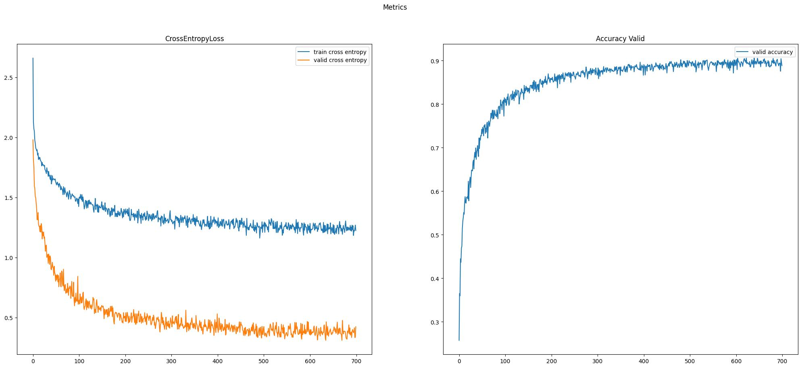

# SWINFromScratch
- This is implementation of vanilla SWIN transformer
- Trained and evaluated on CIFAR10 dataset
- SWIN architecture paper - https://arxiv.org/pdf/2103.14030

## Reproduction
1. Create venv from requirements.txt

    `pip install -r requirements.txt`
2. You can look at the availible parameters

    `python train.py --help`
3. Then you can start training with your parameters

    `python train.py --metrics_path='./data/default_paramters'`

## Metrics
**Cutmix+Mixup**
- Best accuracy on CIFAR10 dataset - **0.9056640625**

    `{"best_valid_ce": 0.3095529355108738, "best_valid_accuracy": 0.9056640625, "image_size": 32, "num_classes": 10, "batch_size": 256, "learning_rate": 0.001, "weight_decay": 0.1, "n_epochs": 700}`
    
